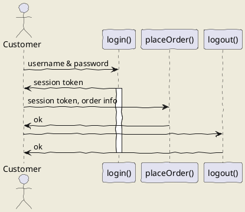

## API
- API stands for Application Programming Interface, it is interface of any type that takes request from client and delivers response (from itself, from other program or mixed -> it is endpoint for client).
- APIs have endpoints for specific requests for web APIs this will be domains in conjunction with HTML request type (GET, POST, PUT, DELETE etc).

## Fetch API: 
- this is API similar to AJAX but newer and (probably) better, window object has member fetch
- fetch returns promise Object - it is asynchronous by default. **new Promise((resolve, reject) => {Body})**
- fetch returns nested Promise (I don't know why) so to unpack actual response use:
  ```
  fetch('http://example.com/movies.json')
    .then((response) => response.json()) // first Promise: response consist of all HTTP response: with headers .json takes data and resolves it as JSON format
    .then((data) => console.log(data)); // this block is actually dealing with data and how to process it
  ```
- in fetch API HTML errors **are NOT** handled by default by .catch() -> response must be checked: res.ok field tells if http request ended with error or not: 
  ```
      fetch('https://devcamper.io/api/v1/bootcamps/34343')
      .then(res => res.json())
      .then(res => {
        if (!res.ok) {
           throw new Error(res.error);
        }
        return res;
      })
      .catch(err => console.log(err));
  ```
  ### OR
  ```
    function handleErrors(res) {
      if (!res.ok) throw new Error(res.error);
      return res;
    }
     
    fetch('https://devcamper.io/api/v1/bootcamps/34343')
      .then(res => res.json())
      .then(handleErrors)
      .then(res => console.log(res.data))
      .catch(err => console.log(err));
   ```  

   - Typical uses of fetch for **GET** and **POST** HTTP methods
  ```
  class EasyHttp {

    httpGetOnUrl(url) {
      return new Promise((resolve, reject) => {
        fetch(url)
          .then(result => result.json())
          .then(data => resolve(data))
          .catch(err => reject(err));
      })
        
    }

    httpPostOnUrl(url, data) {
      return new Promise((resolve, reject) => {
        fetch(url, {
            method: 'POST',
            headers: {
              'Content-type': 'application/json'
            },
            body: JSON.stringify(data)
          })
          .then(result => result.json())
          .then(data => resolve(data))
          .catch(err => reject(err));
      });
    }
  }
  ```
- Async keyword: async keyword in function definition makes this function return Promise object:
  ```
  async function myFunc() { // even though myFunc should return 'HELLO' in fact it returns Promise with body tied to then method
    return 'HELLO';
  }

  myFunc().then(res => console.log(res)); // usage of the Promise
  ```
- Await keyword: await keyword synchronizes async functions: it will block execution until async function is not completed. Usage: 
  ```
  async function getUsers() {
    const response = await fetch('someDomainUrl'); // fetch returns promise but it will be process only when resolved - in synchronous way due to await keyword
    const data = await response.json(); // response was also promise
    return data;
  }
  ```
## Lambdas AKA "Arrow Function"

- Lambdas in class declaration preserve **this** operator: inside of method you cannot use:
  `
  function() { 
    this.someField.someAction();
    //rest of the body
  }
  `
  **but you can** 
  `
  () => {
    this.someField.someAction();
    //rest of the body
  }
  `
- Look out if you want to return Object literal in lambda: 
  `const sayHello = () => {msg: 'Hello'};` : lambda will take curly braces as a body of the function not Object boundaries. To avoid that wrap Object in normal parentheses: `const sayHello = () => ({msg: 'Hello'});`
- Single parameter lambda don't need parentheses: ```name => console.log(`Hello ${name}`);```

## MISC

- In ES6 if you are creating Object literal that is inicialized by some predefined values you dont need to specify names of the fields/keys if they are the same as name of the passed value:

```
const value1 = 'something';
const value2 = 'somethingElse';
const value3 = 37;

const objectLiteral1 = {
  value1: value1,
  value2: value2,
  value3: value3 
};
const objectLiteral2 = {value1, value2, value3};
objectLiteral1 === objectLiteral2 // TRUE
```
## REGEX:
- in JavaScript reqex is defined by using /regex/ for example: `let re = /^[0-9]3-[0-9]3-[0-9]3$/`
- printing regular expression in the console will preserve `'/'` slashes, to print only body of regex use: `console.log(re.source)`
- you may check regular expresion using `exec()` example: 
```
let re = /^[0-9]{3}-[0-9]{3}-[0-9]{3}$/;
console.log(re.exec('324-543-564'));

// Will produce: 

0: "324-543-564"
groups: undefined
index: 0
input: "324-543-564"
length: 1
```
if there will be no match exec will return `null`, if there is more than one match fitting, exec will return **only the first one**
- .test() - returns true or false: if pattern is matched or not: `regexPattern.test(matcher)`
- you may specify regular expressions with flags - puting them after closing slash: /regex/flag, examples: 
```
 i - case insensitive: let re = /0x[1-4a-f]{4}/i
 g - global search - will return every instance that match the pattern - not only fist one 
```
### All functions below have the same format: string.function(regexAsArgument, possibleOtherArguments);
- match - works like exec but is used in diffrent way: `regex.exec(matcher)` **vs** `matcher.match(regex)`
- search - returns index of matched patter, if not found returns `-1`, usage as in match: `someString.search(re);`
- replace - replace substrings of string which are matching the pattern with other provided string: `str.replace(regex, str2)` - will replace all substrings in str that are matched by regex by str2. 
- regex quantifiers: 
1)  {n} - preceding expression/character must come in 'n' ammount
2)  {n,m} - preceding expression/character must come in at least 'n' ammount and at most 'm'
3)  {,m} - preceding expression/character must come at most in 'm' ammount, {n,} - analogic

## MISC things related to ES6:

- Iterators: they are implemented as follows: 
```
function valuesItertor(values) {
  let valueIndex = 0;
  return {
    next: function() {
      return values.length > valueIndex ? 
        {value: values[valueIndex++], isDone: false} : 
        {value: null, isDone: true};
    }
  } 
}

//Usage:

let names = ['Maciej', 'Maria', 'Kornwalia'];
namesIterator = valuesIterator(names);
namesIterator.next().value; // gives Maciej
namesIterator.next().value; // gives Maria
```

- Generators: special type of functions that can return more than one value: 

```
function* sayNames() { // '*' after function lets js know that this is generator
  yield 'Maciej';
  yield 'Maria';
  yield 'Kornwalia';
}

//Usage:

const nameGenerator = sayNames();
nameGenerator.next(); // gives iterator for {value: Maciej, done: false}
nameGenerator.next(); // gives iterator for {value: Maria, done: false}
```

Generator may have more robust logic, generators return **interators**

---
- Symbols: symbols are primitives that are unique: every initialization of variable by symbol will generate new one: It is ussed to create unique identifiers for objects.
Usage: 
```
const sym1 = Symbol(); // Symbol is primitive: it is not object - thus no new operator
const sym2 = Symbol();
const sym3 = Symbol('xyz'); // you may specify identifier for symbol
const sym4 = Symbol('xyz');
const sym5 = sym1;
if(sym1 === sym2) console.log("1 is true");
if(sym3 === sym4) console.log("2 is true");
if(sym1 === sym1) console.log("3 is true"); // this one is true 
if(sym1 === sym5) console.log("4 is true"); // this one is true
```
Symbols are ignored while using JSON.stringify() and while looping thorugh fileds of the object, symbols are enumerable

---

- Destructuring - assigning variables destructuring objects or arrays:

Arrays: 
```
let a, b;
[a, b] = [100, 200];
console.log(a, b); // will return 100 200
[a, b, c, ...rest] = [100, 200, 300, 400, 500]
console.log(rest) // will return array: [400, 500]
```
Objects work similar: 
```
({val1, val2} = {val1: 100, val2: 200});
({val1, val2, ...rest} = {val1: 100, j: 200, radius: 3.54, name: 'kas3499'});
console.log(rest) // will return object: {radius: 3.54, name: 'kas3499'};
```
For objects names of the variables must be the same as names of the fields of the object, also whole instruction must be sourounded by `()`, you may specify variables not in order: 
```
let person = {name: 'Maciek', surname: 'Nabialek', age: 29, iq: 129, height: 182, weight: 73};

({name, age, ...rest} = person); 
console.log(rest);

Rest will yield object:
{
  height: 182,
  iq: 129,
  surname: Nabialek,
  weight: 73
}
```

## Design Patterns - check patterns.js for examples

Test UML diagram


### 1) Module Pattern  
This pattern lets you define private part of the module and return kind of interface to communicate with this module: 
```
(function(){ // ify - function that is invoked and declared at the same time
  // Private parts of the module: states and behaviours
  return {
    object that is public interface for the module
  }
})(); // in argumenst of the function we can pass initial state
```
### 2) Relealing Module Pattern

Very similar pattern, only diffrence is that returned object literal have mapped private functions - so you are accessing them directly instead of using some proxy

*in JS private variables are marked by convetnion with '_' preceeding name ie: _data*

### 3) Singleton Pattern

Variation of the module pattern, it has getInstance method that will always return same instace - this is the only endpoint to get that instance.

```
const Singleton = (function(){
  let _instance;
  function getInstance() {
    if(!_instance) { 
      instance = new Object({name: 'Maciej', surname: 'Nabialek', id: 3});
    }
    return _instance;
  }
  return { getInstance };
})();
```
### 4) Factory Pattern
This is standard factory pattern in JS it is done as the method:
```
function createMember(typeOfMembership, userInfo) {
  switch(typeOfMembership) {
    case 'type1': return type1Membership(userInfo);
    case 'type2': return type2Membership(userInfo);
    case 'type3': return type3Membership(userInfo);
    ...
  }
}
```

### 5) Observer Pattern
This is like vanilla observer pattern
### 6) Mediator Pattern 
Also vanilla pattern